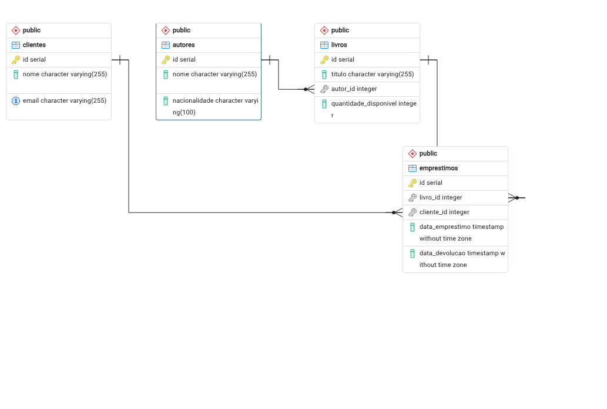

# BookStore Manager CLI

Sistema de gerenciamento de uma livraria que roda no terminal. Controla autores, livros, clientes e empréstimos, guardando tudo em um banco PostgreSQL.

Projeto final do Módulo 01 - Desenvolvedor Back End Node.

## Objetivo

Substituir o controle manual de uma livraria pequena por uma aplicação de terminal. O sistema faz o cadastro, consulta, atualização e remoção dos registros, controla o empréstimo e a devolução dos livros e gera relatórios a partir de consultas no banco.

Do lado técnico, o projeto aplica arquitetura em camadas, programação orientada a objetos, programação assíncrona e SQL relacional.

## Tecnologias utilizadas

- Node.js 22
- TypeScript 6
- PostgreSQL 16
- pg (driver do PostgreSQL)
- dotenv (leitura das credenciais do arquivo .env)
- prompt-sync (leitura da entrada do usuário no terminal)
- ts-node-dev (execução em desenvolvimento)

## Requisitos para execução

- Node.js 18 ou superior
- npm
- PostgreSQL 12 ou superior rodando na máquina

## Instalação

Clone o repositório e instale as dependências:

```bash
git clone https://github.com/Hagmayer1969/bookstore-manager-cli.git
cd bookstore-manager-cli
npm install
```

## Configuração do banco de dados

Crie o banco:

```bash
createdb bookstore
```

Ou, se preferir pelo psql:

```sql
CREATE DATABASE bookstore;
```

Rode o script que cria as tabelas:

```bash
psql -U postgres -d bookstore -f src/banco/schema.sql
```

O script cria as quatro tabelas com as chaves primárias e estrangeiras. Ele não popula o banco com dados.

Depois copie o arquivo de exemplo das variáveis de ambiente e preencha com as suas credenciais:

```bash
cp .env.example .env
```

O `.env` fica assim:

```
DB_HOST=localhost
DB_PORT=5432
DB_USER=postgres
DB_PASSWORD=sua_senha
DB_NAME=bookstore
```

O `.env` não vai para o repositório, está no `.gitignore`. Se faltar alguma variável obrigatória, a aplicação avisa na hora de subir, em vez de falhar depois na primeira consulta.

## Execução

Modo de desenvolvimento:

```bash
npm run dev
```

Compilar o projeto:

```bash
npm run build
```

## Arquitetura do projeto

A aplicação é dividida em camadas, cada uma com uma responsabilidade. O fluxo de uma operação é sempre o mesmo:

```
Usuário -> Menu -> Controlador -> Serviço -> Repositório -> PostgreSQL
```

| Camada | Responsabilidade |
| --- | --- |
| Main | Inicia a aplicação e chama o menu principal |
| Menus | Organiza a navegação entre os módulos |
| Controladores | Conversam com o usuário: leem a entrada, exibem os resultados e as mensagens de erro |
| Serviços | Guardam as regras de negócio: validam, normalizam e coordenam antes de tocar no banco |
| Repositórios | Executam o SQL. É a única camada que fala com o PostgreSQL |
| Modelos | Interfaces e tipos das entidades |
| Banco | Configuração da conexão e o script SQL de criação |
| Utilitários | Funções reutilizáveis, como o tratamento de datas |

Três decisões que valem explicar:

O erro sempre sobe até o controlador. Os serviços e repositórios lançam `Error` com uma mensagem clara, e quem captura é o controlador, dentro de um `try/catch`. Isso mantém o `console.log` concentrado na camada que fala com o usuário e evita que uma falha derrube a aplicação.

A validação acontece em duas alturas. O controlador confere o formato da entrada (se o ID é número, se a data está em YYYY-MM-DD) e o serviço confere a regra de negócio (se o autor existe, se o livro está disponível, se o registro já está cadastrado). São coisas diferentes e ficam separadas.

As listagens mostram nomes, não números. O livro aparece com o nome do autor, e o empréstimo aparece com o título do livro e o nome do cliente. Isso é resolvido com `INNER JOIN` na camada de repositório, trazendo o dado legível numa única consulta. O ID continua sendo usado apenas como entrada, para identificar qual registro a operação deve afetar.

## Funcionalidades implementadas

### Autores
- Cadastrar, listar, buscar por ID e atualizar
- Não aceita autor com nome repetido, ignorando maiúsculas e espaços nas pontas

### Livros
- Cadastrar, listar, buscar por ID, atualizar, remover e listar por autor
- Todo livro precisa estar vinculado a um autor que já exista
- Não aceita o mesmo título repetido para o mesmo autor
- Não remove livro que tenha empréstimo registrado
- Nas listagens e consultas o livro aparece com o nome do autor, não com o número do autor_id

### Clientes
- Cadastrar, listar, buscar por ID, atualizar e remover
- Email é único e precisa ter formato válido
- Não remove cliente que tenha empréstimo registrado

### Empréstimos
- Emprestar, devolver, listar todos, buscar por ID e listar os ativos
- Antes de emprestar valida se o livro existe, se o cliente existe e se há quantidade disponível
- Emprestar diminui a quantidade disponível, devolver aumenta de volta
- Não devolve um empréstimo que já foi devolvido
- As duas operações rodam em transação: se qualquer passo falhar, nada é gravado
- As consultas apresentam o título do livro e o nome do cliente, não os números de livro_id e cliente_id

### Relatórios
- Livros disponíveis
- Livros emprestados
- Livros cadastrados por autor
- Quantidade de empréstimos por livro
- Clientes com empréstimos ativos
- Resumo geral do sistema
- Top 5 livros mais emprestados
- Top 5 clientes mais ativos
- Livros esgotados

Os relatórios usam INNER JOIN, LEFT JOIN, GROUP BY, ORDER BY, LIMIT e funções de agregação.

## Estrutura de pastas

```
bookstore-manager-cli/
├── src/
│   ├── main.ts                  inicia a aplicação
│   ├── banco/
│   │   ├── conexao.ts           pool de conexão com o PostgreSQL
│   │   └── schema.sql           script de criação das tabelas
│   ├── menus/
│   │   └── menuPrincipal.ts     navegação entre os módulos
│   ├── controladores/
│   │   ├── AutorControlador.ts
│   │   ├── LivroControlador.ts
│   │   ├── ClienteControlador.ts
│   │   ├── EmprestimoControlador.ts
│   │   └── RelatorioControlador.ts
│   ├── servicos/
│   │   ├── AutorServico.ts
│   │   ├── LivroServico.ts
│   │   ├── ClienteServico.ts
│   │   ├── EmprestimoServico.ts
│   │   └── RelatorioServico.ts
│   ├── repositorios/
│   │   ├── AutorRepositorio.ts
│   │   ├── LivroRepositorio.ts
│   │   ├── ClienteRepositorio.ts
│   │   ├── EmprestimoRepositorio.ts
│   │   └── RelatorioRepositorio.ts
│   ├── modelos/
│   │   ├── Autor.ts
│   │   ├── Livro.ts
│   │   ├── Cliente.ts
│   │   ├── Emprestimo.ts
│   │   └── Relatorio.ts
│   └── utilitarios/
│       └── DataUtil.ts          conversão e formatação de datas
├── docs/
│   └── diagrama-er.png          diagrama entidade-relacionamento do banco
├── .env.example
├── .gitignore
├── package.json
├── tsconfig.json
└── README.md
```

## Banco de dados

Quatro tabelas relacionadas:

```
autores (1) ----< livros (1) ----< emprestimos >---- (1) clientes
```

| Tabela | Campos |
| --- | --- |
| autores | id (PK), nome, nacionalidade |
| livros | id (PK), titulo, autor_id (FK autores), quantidade_disponivel |
| clientes | id (PK), nome, email (único) |
| emprestimos | id (PK), livro_id (FK livros), cliente_id (FK clientes), data_emprestimo, data_devolucao |

`data_devolucao` fica nula enquanto o livro não voltar. É esse campo que separa um empréstimo ativo de um já encerrado.

### Diagrama ER

Diagrama gerado no pgAdmin a partir do banco `bookstore`, mostrando as quatro tabelas, seus tipos, as chaves primárias (PK) e estrangeiras (FK) e os relacionamentos:



Os relacionamentos são todos de um-para-muitos:

- **autores → livros** — um autor pode ter vários livros (`livros.autor_id` referencia `autores.id`)
- **livros → emprestimos** — um livro pode aparecer em vários empréstimos (`emprestimos.livro_id` referencia `livros.id`)
- **clientes → emprestimos** — um cliente pode ter vários empréstimos (`emprestimos.cliente_id` referencia `clientes.id`)

A tabela `emprestimos` é a que associa livros e clientes, registrando cada operação de empréstimo e devolução.

## Exemplos de utilização

Ao subir, a aplicação mostra o menu principal:

```
=== BookStore Manager CLI ===

1. Autores
2. Livros
3. Clientes
4. Emprestimos
5. Relatorios
0. Sair

Escolha uma opcao:
```

### Cadastrar um autor

```
=== Criar Novo Autor ===

Digite o nome do autor: Machado de Assis
Digite a nacionalidade (opcional): brasileiro

Autor criado com sucesso!
ID: 1
Nome: Machado de Assis
Nacionalidade: brasileiro
```

### Emprestar um livro

```
=== Emprestar Livro ===

Digite o ID do livro: 1
Digite o ID do cliente: 1
Digite a data do emprestimo (YYYY-MM-DD): 2026-07-15

Emprestimo realizado com sucesso!
ID: 1
Livro: Dom Casmurro
Cliente: Joao Oliveira
Data de Emprestimo: 15/07/2026
```

### Listar livros

```
=== Lista de Livros ===

1. Dom Casmurro (Autor: Machado de Assis, Quantidade: 3)
2. Memorias Postumas de Bras Cubas (Autor: Machado de Assis, Quantidade: 2)
3. A Hora da Estrela (Autor: Clarice Lispector, Quantidade: 3)
```

### Listar empréstimos

```
=== Lista de Emprestimos ===

1. Livro: Dom Casmurro, Cliente: Joao Oliveira, Emprestimo: 15/07/2026, Ativo (nao devolvido)
2. Livro: Sao Bernardo, Cliente: Maria Souza, Emprestimo: 12/07/2026, Devolvido em 16/07/2026
```

### Um relatório

```
=== Livros Cadastrados por Autor ===

1. Machado de Assis: 2 livro(s)
2. Clarice Lispector: 2 livro(s)
3. Cecilia Meireles: 1 livro(s)
```

### Erros tratados

A aplicação não cai por causa de uma entrada errada ou de uma regra quebrada. Ela mostra a mensagem e volta para o menu:

```
Erro ao emprestar livro: Livro com id 999 nao existe

Erro ao emprestar livro: Livro com id 2 nao tem quantidade disponivel

Erro ao criar autor: Ja existe um autor cadastrado com o nome "Machado de Assis"

Erro ao deletar livro: Livro nao pode ser removido: existe(m) 3 emprestimo(s) registrado(s) para ele

Erro ao criar cliente: Email invalido. Use o formato nome@dominio.com
```

## Observação sobre a digitação no terminal

A biblioteca `prompt-sync` não trata as teclas Delete e as setas. Se você usar essas teclas para corrigir o que está digitando, os caracteres de controle entram no texto e vão parar no banco. Use Backspace para apagar.

## Integrantes

- Edson Hagmayer - https://github.com/Hagmayer1969

## Kanban

https://hagtech.atlassian.net/browse/BSM
